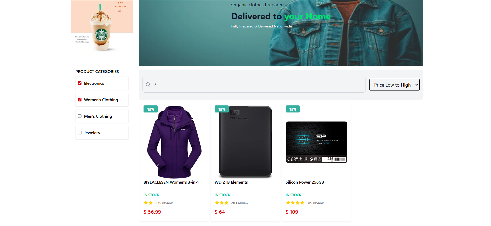
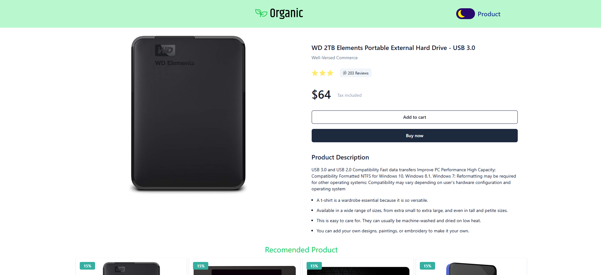
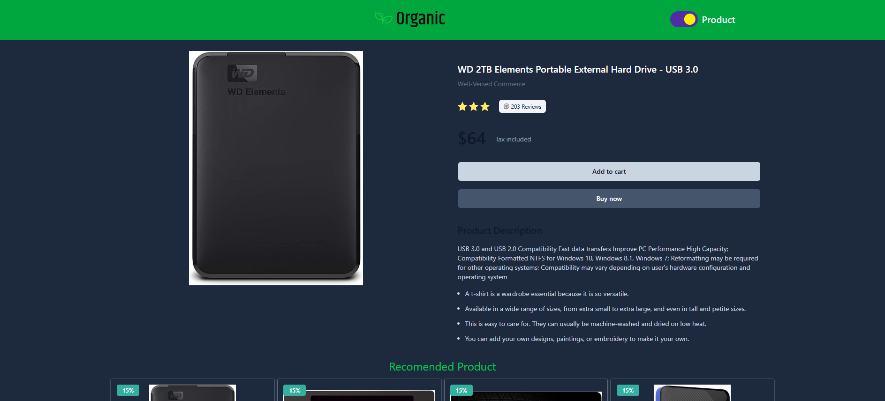

# 🛍️ Products Gallery Web Application

## 📝 Project Overview

The **Products Gallery Web Application** is a fully responsive e-commerce frontend built using Angular and Tailwind CSS. It interacts with the [Fake Store API](https://fakestoreapi.com/) to showcase products in a modern UI.

### ✨ Features

* Browse and view products from an external API
* Product search by name (case-insensitive)
* Sorting by price and product name
* Responsive product cards with images and titles
* Dynamic product details page with complete information
* Smooth navigation with Angular routing
* Error handling, loading indicators, and empty states

---

## 📸 Screenshots

### 🏠 Home / Products Page


### 🔍 Filtered Products


### 📄 Product Details Page


### 🌞 Dark Mode 




### 🏠 Home / Products Page

### 🔍 Filtered Products

### 📄 Product Details Page

> 💡 *You can replace the above image paths with actual image URLs or local paths inside a ******`/screenshots`****** folder.*

---

## 🧱 Tech Stack Used

| Layer              | Technology                                  |
| ------------------ | ------------------------------------------- |
| Frontend Framework | [Angular 19](https://angular.io/)          |
| UI Styling         | [Tailwind CSS v4](https://tailwindcss.com/)    |
| API Source         | [Fake Store API](https://fakestoreapi.com/) |
| State Management   | Angular Services                            |
| Routing            | Angular Router                              |
| HTTP Requests      | Angular `HttpClient` with fitch             |

---

## 🚀 Getting Started

### 📦 Installation

```bash
git clone https://github.com/Kareem-Mohamed-Farouh/product-task-Filtration.git
cd products-gallery
npm install
```

##▶️ Run the Application
```bash
ng serve
```

##📂 Project Structure
```bash
src/
├── app/
│   ├── core/              // Services
│   │    ├── base/
│   │    ├── gaurds/
│   │    ├── components/
│   │    ├── intterceptor/
│   │    ├── servieces/
│   │ 
│   ├── Featur/        //  components (e.g., ProductCard)
│   │    ├── layOut/
│   │    ├── pages/

│   └── share/             // components && pipes && directives && interfaces

```


##🤝 Contributing
Pull requests are welcome. For major changes, please open an issue first to discuss what you'd like to change.


📄 License
This project is open-source and free to use for educational or demo purposes.

📬 Contact
If you have any questions or suggestions, feel free to reach out:

Email: karimfarouh7@gimail.com

GitHub: https://github.com/Kareem-Mohamed-Farouh
